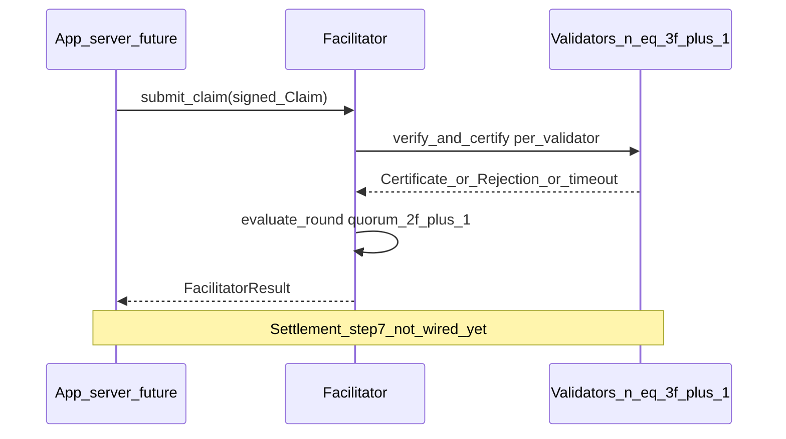

# FastSet seven-step mapping (this codebase)

This document ties the [FastSet protocol lifecycle](https://docs.fast.xyz/advanced/fastset-protocol) (as described in public Fast documentation) to modules in **agentic-settlement**, and calls out what is implemented versus planned.

## Parameterization: `3f+1` validators, `2f+1` quorum

This project uses the standard FastSet/FastPay parameterization: **`n = 3f+1`** validators tolerating up to **`f`** Byzantine faults, with a quorum of **`2f+1`** valid certificates. The facilitator waits until every validator has either responded or timed out before evaluating quorum.

## The seven steps (Fast docs) and this repo

| Step | Name (Fast docs) | Implemented here | Notes / future work |
|------|-------------------|------------------|---------------------|
| 1 | Transaction / claim creation | [`create_claim`](../src/core/claim.py), [`Claim`](../src/core/claim.py) | Client signs a canonical payload (length-prefixed fields). Future: batch several claims in one transaction `⟨c₁, …, cₖ, nonce⟩` if required. |
| 2 | Verification (optional) | Not implemented | Future: optional verifiers sign the transaction; aggregate proofs; enforce verifier quorum before validators see the claim. |
| 3 | Validation | [`Validator.verify_and_certify`](../src/core/validator.py) | Checks sender signature, accounts, nonce, pending slot, amount, balance (mirrors the doc’s validation bullets). |
| 4 | Validator signature | [`Certificate`](../src/core/validator.py) | Each accepting validator signs the claim payload and records pending state for the sender. |
| 5 | Certificate / quorum assembly | [`Facilitator.submit_claim`](../src/core/facilitator.py), [`evaluate_round`](../src/core/facilitator.py) | Collects outcomes from **`3f+1`** endpoints, verifies validator signatures, handles duplicates/faults, requires **`2f+1`** valid certificates for quorum. Fast docs describe a **proxy** assembling one quorum proof; here the facilitator keeps a **set of per-validator certificates** (no aggregate signature) as a deliberate simplification. Future: optional aggregated certificate object. |
| 6 | Pre-settlement | Not implemented | Future: broadcast quorum proof to every validator; move the transaction into a **presettled** queue respecting nonce ordering across the pipeline. |
| 7 | Settlement | [`Validator.settle`](../src/core/validator.py) | Applies balances and nonce, clears pending. Future: app or facilitator drives settlement **after** quorum (and presettlement), with coordinated two-phase behavior if multiple validators must commit together. |

## End-to-end flow (conceptual)

## References

- Fast documentation: [FastSet Protocol](https://docs.fast.xyz/advanced/fastset-protocol)
- Formal treatment: [FastSet whitepaper (arXiv)](https://arxiv.org/abs/2506.23395)
