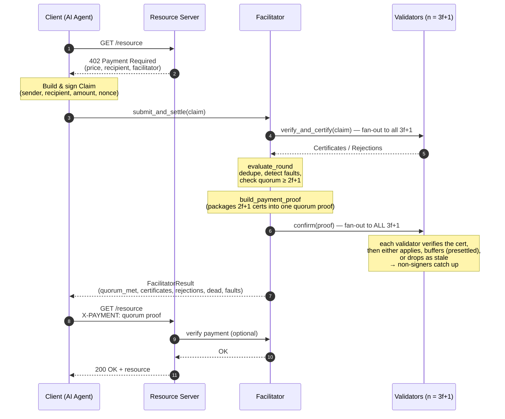

# FastSet seven-step mapping (this codebase)

This document ties the [FastSet protocol lifecycle](https://docs.fast.xyz/advanced/fastset-protocol) (as described in public Fast documentation) to modules in **agentic-settlement**, and calls out what is implemented versus planned.

## Parameterization: `3f+1` validators, `2f+1` quorum

This project uses the standard FastSet/FastPay parameterization: **`n = 3f+1`** validators tolerating up to **`f`** Byzantine faults, with a quorum of **`2f+1`** valid certificates. The facilitator waits until every validator has either responded or timed out before evaluating quorum.

## The seven steps (Fast docs) and this repo

| Step | Name (Fast docs) | Implemented here | Notes / future work |
|------|-------------------|------------------|---------------------|
| 1 | Transaction / claim creation | [`create_claim`](../src/core/claim.py), [`Claim`](../src/core/claim.py) | Client signs a canonical payload (length-prefixed fields). Future: batch several claims in one transaction `⟨c₁, …, cₖ, nonce⟩` if required. |
| 2 | Verification (optional) | Not implemented | Future: optional verifiers sign the transaction; aggregate proofs; enforce verifier quorum before validators see the claim. |
| 3 | Validation | [`Validator.verify_and_certify`](../src/core/validator.py) | Checks sender signature, accounts, nonce, pending slot, amount, balance (mirrors the doc’s validation bullets). |
| 4 | Validator signature | [`Certificate`](../src/core/validator.py) | Each accepting validator signs the claim payload and records pending state for the sender. |
| 5 | Certificate / quorum assembly + broadcast (Confirm) | [`Facilitator.submit_claim`](../src/core/facilitator.py), [`evaluate_round`](../src/core/facilitator.py), [`build_payment_proof`](../src/core/quorum_proof.py), [`Facilitator.submit_and_settle`](../src/core/facilitator.py) | Collects outcomes from **`3f+1`** endpoints, verifies validator signatures, handles duplicates/faults, requires **`2f+1`** valid certificates for quorum. `build_payment_proof` packages those certs into a single transferable quorum proof; `submit_and_settle` then broadcasts that proof back to **every** validator (signers and non-signers alike) via `Validator.confirm`. We keep a set of per-validator signatures rather than an aggregated multi-sig as a deliberate simplification; aggregation is future work. |
| 6 | Pre-settlement | [`Validator.confirm`](../src/core/validator.py), `Validator._presettled` | Each validator verifies the quorum cert against its known peer set (≥ `2f+1` signatures from configured pubkeys), then either applies immediately if `claim.nonce == local_nonce`, **buffers** the cert in `_presettled[(sender, nonce)]` if it arrived ahead of its turn, or drops it as stale. Buffered certs drain in nonce order as earlier ones arrive — the slides' inevitability property is honored: a certified claim with all prior nonces certified will be settled locally without facilitator coordination. |
| 7 | Settlement | [`Validator._apply`](../src/core/validator.py), [`Validator.settle`](../src/core/validator.py) | The internal apply step: debit sender, credit recipient, increment nonce, clear pending slot. Driven by `confirm()` through the buffer drain; `settle()` remains as a direct primitive for tests and tooling. Validators that rejected or timed out during validation now **catch up automatically** when the facilitator's `confirm` broadcast reaches them. Permanently unreachable validators stay divergent until they come back online and re-request the cert (future: cert gossip / replay endpoint). |

## End-to-end flow (target shape, f=1 so n=4)

The diagram below mirrors the layout of the [x402 flow diagram](https://github.com/x402-foundation/x402#typical-x402-flow) and shows the full intended pay-to-unlock path. Solid lanes that are implemented today: **Client**, **Facilitator**, **Validators**. The **Resource Server** lane and the x402 `402 Payment Required` / `X-PAYMENT` retry handshake are **planned** -- today the `Client` calls the `Facilitator` in-process.

```mermaid
sequenceDiagram
  autonumber
  participant C as Client (AI Agent)
  participant S as Resource Server
  participant F as Facilitator
  participant V as Validators (n = 3f+1)

  C->>S: GET /resource
  S-->>C: 402 Payment Required<br/>(price, recipient, facilitator)
  Note over C: Build & sign Claim<br/>(sender, recipient, amount, nonce)
  C->>F: submit_and_settle(claim)
  F->>V: verify_and_certify(claim) — fan-out to all 3f+1
  V-->>F: Certificates / Rejections
  Note over F: evaluate_round<br/>dedupe, detect faults,<br/>check quorum ≥ 2f+1
  Note over F: build_payment_proof<br/>(packages 2f+1 certs into one quorum proof)
  F->>V: confirm(proof) — fan-out to ALL 3f+1
  Note over V: each validator verifies the cert,<br/>then either applies, buffers (presettled),<br/>or drops as stale<br/>→ non-signers catch up
  F-->>C: FacilitatorResult<br/>(quorum_met, certificates, rejections, dead, faults)
  C->>S: GET /resource<br/>X-PAYMENT: quorum proof
  S->>F: verify payment (optional)
  F-->>S: OK
  S-->>C: 200 OK + resource
```

Each validator's internal check inside `verify_and_certify` is: sender signature valid, sender pubkey matches account owner, nonce matches, no pending claim for this sender, amount positive, balance sufficient. Inside `confirm`: verify ≥ `2f+1` signatures over the claim payload using the locally-configured peer pubkey set, then either apply (if `nonce == local_nonce`), buffer in `_presettled` (if `nonce > local_nonce`), or drop as stale (if `nonce < local_nonce`). The apply step itself (`_apply`, also reachable via the bare `settle` primitive) debits sender, credits recipient, increments sender nonce, clears the pending slot.

## References

- Fast documentation: [FastSet Protocol](https://docs.fast.xyz/advanced/fastset-protocol)
- Formal treatment: [FastSet whitepaper (arXiv)](https://arxiv.org/abs/2506.23395)
